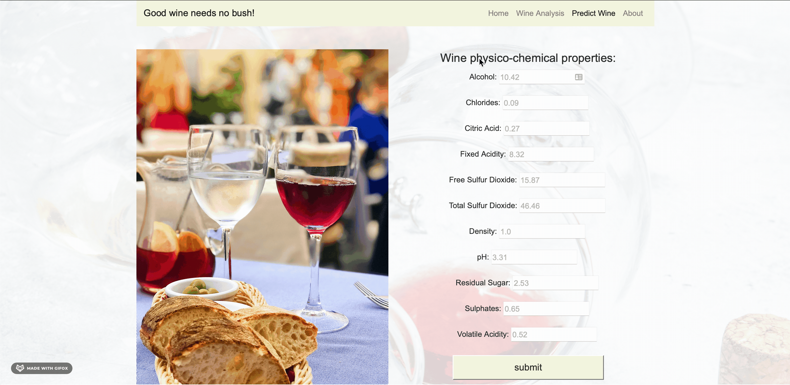
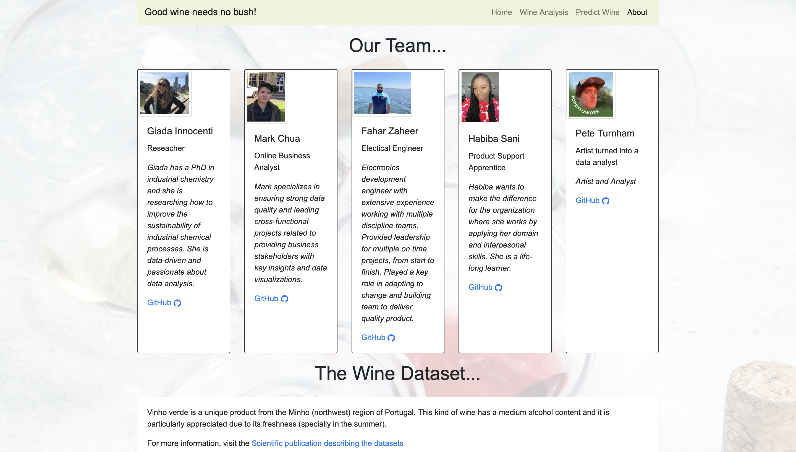

# WineQualityMLProject
What makes a wine good? Is data analytics able to predict what physical-chemical characteristics make a good wine? Our team decided to take this challenge.
A machine learning model for predicting wine quality.

# General approach to the problem
1. The dataset will be cleaned and put into an SQL database.
2. Python was used to carry out a multivariate linear regression.
3. PCA (Principal component analysis) was used to reduce the problem dimensions
4. kNN (k-Nearest Neighbor) was use to classify both the type and the quality of wine.
5. The wines were divided into two types: red and white and 3 categories for quality: 'good','average','bad'.
6. The data was deployed by using Heroku and a flask app. [Check it out!](https://winequalityml.herokuapp.com/)

# Flask structure and web page images
```
\
```
The home page is simple and tries to explain in a few words the motivation.

```
\analysis
```
The main take home messages and conclusions from the data analysis are reported in this page with additional information sources.

```
\prediction
```
The prediction page is the fun page, the user can insert its own prediction and a plot will be generated showing where the predicted point is with respect to the model points. The plot is updated live until the user leaves the page, at that point the plot refreshes.

```
\about
```


# Dataset
[Wine Quality Datasets](http://www3.dsi.uminho.pt/pcortez/wine/)

# References
1. P. Cortez, A. Cerdeira, F. Almeida, T. Matos and J. Reis. Modeling wine preferences by data mining from physicochemical properties. In Decision Support Systems, Elsevier, 47(4):547-553, 2009.
2. Scikit-learn: Machine Learning in Python, Pedregosa et al., JMLR 12, pp. 2825-2830, 2011.
